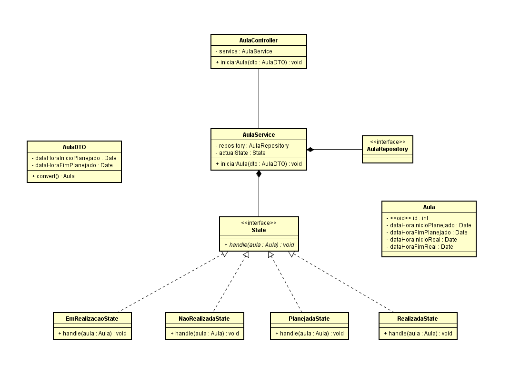

# Exercício 01 - Arquitetura de Software PPCA



## Aluno: Henrick de Sousa Nogueira

## 📚 Descrição

Este projeto implementa um sistema de gerenciamento do ciclo de vida de aulas, utilizando o padrão de projeto **State** do GoF, conforme os requisitos da disciplina de Arquitetura de Software. A aplicação foi desenvolvida em **Java** utilizando o framework **Spring Boot**, com persistência de dados em **MySQL**.

A API gerencia diferentes estados de uma aula, como "Planejada", "Em Realização", "Realizada" e "Não Realizada". Cada estado encapsula sua lógica específica e utiliza uma abordagem modular para facilitar as transições entre os estados e a manutenção do código.

Além da implementação do padrão **State**, o projeto conta com camadas bem definidas de **repository**, **service** e **controller**, seguindo as boas práticas de arquitetura em camadas. O sistema também inclui endpoints RESTful para manipular as aulas de forma simples e eficaz.

### Implementação do Padrão State

O padrão **State** foi utilizado para gerenciar os estados de uma aula. As classes de estado implementam a interface `State`, que define o método `handle(Aula aula)` responsável por encapsular a lógica de cada estado.

Os estados implementados são:

- **PlanejadaState**: Representa uma aula que está programada para acontecer. Inicia a aula e registra o horário de início real.
- **EmRealizacaoState**: Gerencia o estado em que a aula está em andamento e registra o término da aula.
- **RealizadaState**: Indica que a aula foi finalizada com sucesso, salvando o horário de término.
- **NaoRealizadaState**: Define que a aula não foi realizada e zera os horários de início e fim da aula.

### Models

A modelagem do projeto é baseada nas seguintes entidades:

1. **Aula**: Representa uma aula no sistema, contendo os horários planejados e reais de início e fim. Esta entidade é persistida no banco de dados usando JPA.

   ```java
   @Entity
   public class Aula {
       @Id
       @GeneratedValue(strategy = GenerationType.IDENTITY)
       private Integer id;
       private Date dataHoraInicioPlanejado;
       private Date dataHoraFimPlanejado;
       private Date dataHoraInicioReal;
       private Date dataHoraFimReal;
   }
   ```

2. **AulaDTO**: Um Data Transfer Object que facilita a transferência de dados e a criação de novas aulas a partir das informações fornecidas. Ele inclui validações como `@NotNull` e métodos de conversão para transformar o DTO em uma entidade `Aula`.

   ```java
   public class AulaDTO {
       @NotNull
       private Date dataHoraInicioPlanejado;
       private Date dataHoraFimPlanejado;

       public Aula convert() {
           Aula aula = new Aula();
           aula.setDataHoraInicioPlanejado(dataHoraInicioPlanejado);
           aula.setDataHoraFimPlanejado(dataHoraFimPlanejado);
           return aula;
       }
   }
   ```

### Repository

O repositório **AulaRepository** estende `JpaRepository` para fornecer uma interface de persistência para a entidade `Aula`, permitindo operações CRUD no banco de dados MySQL.

```java
public interface AulaRepository extends JpaRepository<Aula, Integer> {
}
```

### Service

- A camada de serviço, AulaService, é responsável por gerenciar a lógica de negócios e as transições de estado de uma aula. Utiliza o padrão State para alternar entre os diferentes estados de uma aula e salvar as mudanças no banco de dados por meio do repositório.

```java
@Service
public class AulaService {

    @Autowired
    private AulaRepository repository;
    private State actualState;

    public AulaService() {
        this.actualState = new PlanejadaState();
    }

    @Transactional
    public void iniciarAula(AulaDTO dto) {
        Aula aula = dto.convert();
        this.actualState.handle(aula);
        repository.save(aula);

        boolean isAfter = CalendarSystem.isAfter(dto.getDataHoraInicioPlanejado());
        if (isAfter) {
            this.actualState = new NaoRealizadaState();
        } else {
            this.actualState = new EmRealizacaoState();
            this.actualState.handle(aula);
            this.actualState = new RealizadaState();
        }
        this.actualState.handle(aula);
    }
}

```

### Controller

- A API expõe um endpoint RESTful para iniciar uma aula. O AulaController recebe os dados da aula através de um DTO, valida as informações e chama o serviço para iniciar a aula e realizar as transições de estado conforme o ciclo de vida definido.

```java

@RestController
@AllArgsConstructor
@RequestMapping("/api/aulas")
public class AulaController {

    private final AulaService aulaService;

    @PostMapping("/iniciar")
    @ResponseStatus(code = HttpStatus.NO_CONTENT)
    public void iniciarAula(@RequestBody @Valid AulaDTO aula) {
        aulaService.iniciarAula(aula);
    }
}


```

## 🛠 Tecnologias

-  [Java](https://www.java.com/pt-BR)
-  [Spring Boot](https://spring.io/projects/spring-boot)
-  [MySQL](https://www.mysql.com/)


## End-point

### /api/aulas/iniciar

#### POST
##### Responses

| Code | Description |
| ---- | ----------- |
| 204 | No Content |